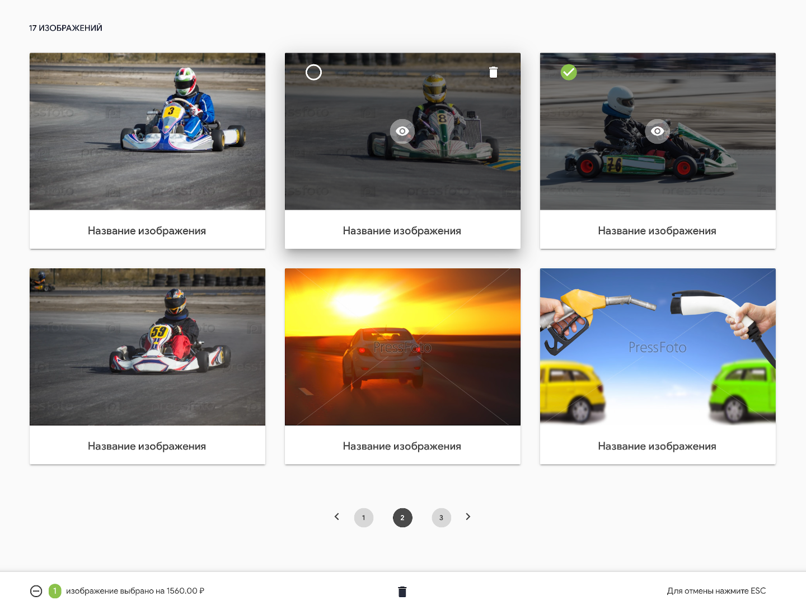

<a href="https://tz-everypixel-7lnq8fow8-greenbugerbytes-projects.vercel.app/" alt="ссылка на проект"> Посмотреть результат </a>

<h3>ТЕСТОВОЕ ЗАДАНИЕ </h3>
Нужно сверстать страницу по макету в файле page.png, используя данные из файла data.json.

Активные элементы:
1. Белый кружок в левом верхнем углу изображений - чекбокс, появляется при наведении мыши на изображение. Выделяет / снимает выделение.
     Если отмечен - становится зеленым с белой галочкой и не исчезает.
2. Черный кружок в нижней панели - выделить все / снять выделение. Рядом в зеленом кружочке - количество выбранных изображений.
3. Значок удаления в правом верхнем углу изображений - появляется при наведении мыши, при нажатии удаляет изображение.
4. Значок удаления выбранных изображений в нижней панели - при нажатии удаляются выбранные изображения.
5. В левом верхнем углу макета текущее количество изображений. При удалении элементов количество должно меняться.
6. Пагинация.

Плюсом сделана простая проверка на доступность фотографий. Файл json выдавал битые ссылки.

Реализовать задание необходимо с использованием javascript библиотеки react.
Для визуального оформления можно использовать Material Design Lite.

